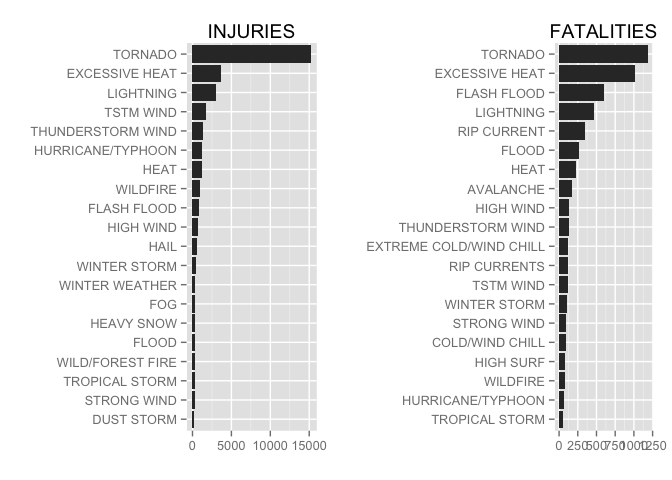

# RepDataPA2
Wegamoon  
September 7, 2014  
#Download and preparement of data.

## Data Download.

Before starting the analysis, download the file form [here](https://d396qusza40orc.cloudfront.net/repdata%2Fdata%2FStormData.csv.bz2). For more information
about this dataset see:

- National Weather Service [Storm Data Documentation][1]

- National Climatic Data Center Storm Events [FAQ][2]

[1]: https://d396qusza40orc.cloudfront.net/repdata%2Fpeer2_doc%2Fpd01016005curr.pdf
[2]: https://d396qusza40orc.cloudfront.net/repdata%2Fpeer2_doc%2FNCDC%20Storm%20Events-FAQ%20Page.pdf


This file is compressed as a bzip2 file, then expand it on your working
directory and rename it to "stormData.csv"

## Read the file.

Read the storm data to a R. This process may take some second. 
Please be patient!


```r
stormdata <- read.csv(file = "stormData.csv")
```

The data from 2000 to present was extracted because there are too many 
variations in "event type" field. 

- [Database datail](http://www.ncdc.noaa.gov/stormevents/details.jsp?type=collection)


```r
library(lubridate)
stormdata$BGN_DATE <- mdy_hms(stormdata$BGN_DATE) # Convert to POSIXct format
stormdata <- stormdata[stormdata$BGN_DATE >= "2000-01-01",] # Subsetting
```


## Which type of events are most harmful with respent to population health?

This database report the number of fatalities and injuries in each event.
First, the sum of the fatalities and injuries in each event name was calculated.


```r
library(plyr)
healthsum <- ddply(stormdata, .(EVTYPE), summarise,
                fatalities = sum(FATALITIES),
                injuries = sum(INJURIES))
```

These data frame are reorderd by the number of fatalities and injuries,
and the top 20 and the sum of other cases are extracted.

The order of factor are arranged by the number of injuries and fatalities.


```r
library(plyr)
injOrd <- arrange(healthsum, desc(injuries))[1:20,c(1,3)]
injOrd$EVTYPE <- factor(injOrd$EVTYPE,
                        levels = injOrd[order(injOrd$injuries),"EVTYPE"])

fataOrd <- arrange(healthsum, desc(fatalities))[1:20, c(1,2)]
fataOrd$EVTYPE <- factor(fataOrd$EVTYPE,
                        levels = fataOrd[order(fataOrd$fatalities),"EVTYPE"])
```

### Plotting
The number of injuries and fatalities from 2000 through 2011.


```r
library(ggplot2)
injOrd$injuries <- as.numeric(injOrd$injuries)
fataOrd$fatalities <- as.numeric(fataOrd$fatalities)

g1 <- ggplot(injOrd, aes(x = EVTYPE, y = injuries)) +
        geom_bar(stat = "identity") +
        ggtitle("INJURIES")+
        ylab(NULL) +
        xlab(NULL) +
        coord_flip()

g2 <- ggplot(fataOrd, aes(x = EVTYPE, y = fatalities)) +
        geom_bar(stat = "identity") +
        ggtitle("FATALITIES")+
        ylab(NULL) + 
        xlab(NULL) +
        coord_flip()

library(grid)
grid.newpage()
pushViewport(viewport(layout=grid.layout(1, 2)))
print(g1, vp=viewport(layout.pos.row=1, layout.pos.col=1))
print(g2, vp=viewport(layout.pos.row=1, layout.pos.col=2))
```

 

Tornadoes outnumbers the other cases in both injuries and fatalities. 
The most harmful event seems to be a tornadoes.
Although the number of injuries because of ECESSIVE HEAT is relatively
small comparing to that of TORNADO, it may ealily lead to death.

## Which type of events have the greatest economic consequence?


```r
summary(stormdata$CROPDMGEXP)
```

```
##             0      2      ?      B      K      M      k      m 
## 250613      0      0      0      4 271351   1195      0      0
```

```r
summary(stormdata$PROPDMGEXP)
```

```
##             +      -      0      1      2      3      4      5      6 
## 189121      0      0      1      0      0      0      0      0      0 
##      7      8      ?      B      H      K      M      h      m 
##      0      0      0     29      0 328461   5551      0      0
```

```r
stormdata$CROPDMGEXP <- gsub("K", "1000", stormdata$CROPDMGEXP)
stormdata$CROPDMGEXP <- gsub("M", "1000000", stormdata$CROPDMGEXP)
stormdata$CROPDMGEXP <- gsub("B", "1000000000", stormdata$CROPDMGEXP)

stormdata$PROPDMGEXP <- gsub("K", "1000", stormdata$PROPDMGEXP)
stormdata$PROPDMGEXP <- gsub("M", "1000000", stormdata$PROPDMGEXP)
stormdata$PROPDMGEXP <- gsub("B", "1000000000", stormdata$PROPDMGEXP)

stormdata$CROPDMGEXP <- as.numeric(stormdata$CROPDMGEXP)
stormdata$PROPDMGEXP <- as.numeric(stormdata$PROPDMGEXP)

stormdata$CROPDMG <- stormdata$CROPDMG * stormdata$CROPDMGEXP
stormdata$PROPDMG <- stormdata$PROPDMG * stormdata$PROPDMGEXP
```

