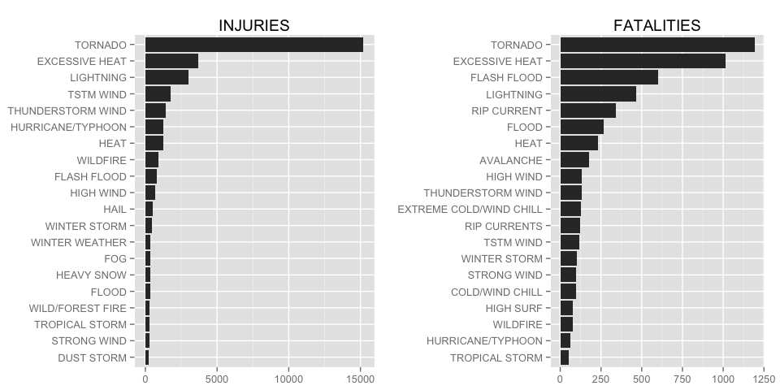

# RepDataPA2
Wegamoon  
September 7, 2014  
#Download and preparement of data.

## Data Download.

Before starting the analysis, download the file form [here](https://d396qusza40orc.cloudfront.net/repdata%2Fdata%2FStormData.csv.bz2). For more information
about this dataset see:

- National Weather Service [Storm Data Documentation][1]

- National Climatic Data Center Storm Events [FAQ][2]

[1]: https://d396qusza40orc.cloudfront.net/repdata%2Fpeer2_doc%2Fpd01016005curr.pdf
[2]: https://d396qusza40orc.cloudfront.net/repdata%2Fpeer2_doc%2FNCDC%20Storm%20Events-FAQ%20Page.pdf


This file is compressed as a bzip2 file, then expand it on your working
directory and rename it to "stormData.csv"

## Read the file.

Read the storm data to a R. This process may take some second. 
Please be patient!

```r
stormdata <- read.csv(file = "stormData.csv")
```

The data from 2000 to present was extracted because there are too many 
variations in "event type" field. 

- [Database datail](http://www.ncdc.noaa.gov/stormevents/details.jsp?type=collection)


```r
library(lubridate)
stormdata$BGN_DATE <- mdy_hms(stormdata$BGN_DATE) # Convert to POSIXct format
stormdata <- stormdata[stormdata$BGN_DATE >= "2000-01-01",] # Subsetting
```


## Which type of events are most harmful with respent to population health?
This database report the number of fatalities and injuries in each event.
First, the sum of the fatalities and injuries in each event name was calculated,
and subsetted the data which recode more than one injury or fatality.


```r
library(plyr)
healthsum <- ddply(stormdata, .(EVTYPE), summarise,
                fatalities = sum(FATALITIES),
                injuries = sum(INJURIES))
healthsum <- healthsum[!(healthsum$fatalities == 0 & healthsum$injuries == 0),]
```

These data frame are reorderd by the number of fatalities and injuries,
and the top ten and the sum of other cases are extracted.

```r
library(plyr)
injOrd <- arrange(healthsum, desc(injuries))[1:20,c(1,3)]
injOrd$EVTYPE <- factor(injOrd$EVTYPE,
                        levels = injOrd[order(injOrd$injuries),"EVTYPE"])

fataOrd <- arrange(healthsum, desc(fatalities))[1:20, c(1,2)]
fataOrd$EVTYPE <- factor(fataOrd$EVTYPE,
                        levels = fataOrd[order(fataOrd$fatalities),"EVTYPE"])
```


```r
library(ggplot2)
injOrd$injuries <- as.numeric(injOrd$injuries)
fataOrd$fatalities <- as.numeric(fataOrd$fatalities)

g1 <- ggplot(injOrd, aes(x = EVTYPE, y = injuries)) +
        geom_bar(stat = "identity") +
        ggtitle("INJURIES")+
        xlab("")+
        ylab("")+
        coord_flip()

g2 <- ggplot(fataOrd, aes(x = EVTYPE, y = fatalities)) +
        geom_bar(stat = "identity") +
        ggtitle("FATALITIES")+
        xlab("")+
        ylab("")+
        coord_flip()

library(grid)
grid.newpage()
pushViewport(viewport(layout=grid.layout(1, 2)))
print(g1, vp=viewport(layout.pos.row=1, layout.pos.col=1))
print(g2, vp=viewport(layout.pos.row=1, layout.pos.col=2))
```

 

The number of injuries and fatalities of tolnado is far more than other.


- How to arrange the order of factors?
- It might be better to merge the facet and colored.
